# Confidence-Aware XAI Prototype

Streamlit prototype for a confidence-aware explainable AI financial decision-support study.

The app uses a trained XGBoost credit-risk model, SHAP-style local feature contributions, and a lightweight behavioural confidence model to compare static and adaptive explanations.

## Run

```bash
streamlit run app.py
```

## Project Structure

```text
app.py                         # Main Streamlit participant-facing prototype
data/                          # Study data and response storage
  raw/german.data              # Local fallback copy of the UCI German Credit data
  selected_applicant_profiles.csv
  simulated_behavioural_confidence_data.csv
  responses/                   # Local response CSVs are ignored by Git
  response_backups/            # Local reset backups are ignored by Git
docs/                          # Methodology notes and optional screenshots
models/                        # Trained model and preprocessing artefacts
notebooks/                     # Original model-development notebooks
scripts/                       # Analysis and maintenance utilities
```

## Dataset Source

The credit-risk model uses the German Credit dataset from the UCI Machine Learning Repository. The app loads the original dataset at runtime from:

```text
https://archive.ics.uci.edu/ml/machine-learning-databases/statlog/german/german.data
```

Dataset information is available from UCI at:

```text
https://archive.ics.uci.edu/dataset/144/statlog+german+credit+data
```

The repository includes curated applicant profiles for the user study in `data/selected_applicant_profiles.csv`. It also includes a local fallback copy of the original UCI data at `data/raw/german.data` so the app can still run if the online source is unavailable.

## Methodology Notes

Additional methodology notes are available in `docs/methodology_notes.md`. These notes summarise the dataset source, model pipeline, confidence-model scope, response fields, analysis approach, and ethical framing.

The study operating procedure and counterbalanced participant patterns are summarised in `docs/study_design_summary.md`.

## Study Flow

1. Review a predefined applicant profile.
2. Submit an initial good/bad credit judgement and confidence rating.
3. View the AI prediction and bad-credit probability.
4. Generate either a static or adaptive explanation.
5. Submit evaluation responses for trust, understanding, usefulness, reliance, and comments.

## Explanation Conditions

- Static: shows a fixed standard explanation with four features.
- Adaptive: adjusts explanation depth using the full trained behavioural confidence-feature row plus self-reported confidence.
  - Low confidence: detailed explanation.
  - Medium confidence: moderate explanation.
  - High confidence: concise explanation.

The app assigns Static or Adaptive automatically from the participant ID and applicant case to reduce study-procedure mistakes:

- Pattern A for odd participant IDs: Applicant A Static, B Adaptive, C Static, D Adaptive, E Static, F Adaptive.
- Pattern B for even participant IDs: Applicant A Adaptive, B Static, C Adaptive, D Static, E Adaptive, F Static.

Responses are saved to `data/responses/user_study_responses.csv`.

Participant IDs are assigned automatically as anonymised codes such as `P001`, `P002`, and so on. The same ID should be used for all cases completed by one participant. Use the sidebar `Start new participant` button when a new person begins the study.

Timing fields distinguish between `ai_prediction_review_time`, measured before the explanation is requested, and `explanation_reading_time`, measured after the explanation is shown and before the evaluation is submitted. The legacy `explanation_view_time` column is kept as the actual explanation-reading time for compatibility.

The adaptive confidence model uses behavioural features from the trained confidence pipeline. Because native Streamlit does not expose browser hover or scroll telemetry without a custom component, the deployed prototype records transparent workflow/review proxies for `scroll_depth` and `hover_count` rather than hidden browser tracking.

## Study Tools

The sidebar includes an optional anonymised participant ID, explanation condition guidance, study progress, a system status panel, and a download button for saved responses.

The app also starts with a short consent/introduction screen explaining that the task is simulated, uses predefined profiles, and does not collect real financial data.

The interface includes a condition badge, model confidence signal, user-versus-AI comparison panel, and explanation-depth indicator to make the adaptive behaviour visible during testing.

## Screenshots

Screenshots are stored in `docs/screenshots/` to show the participant workflow and explanation interface.

### Ethics and Consent

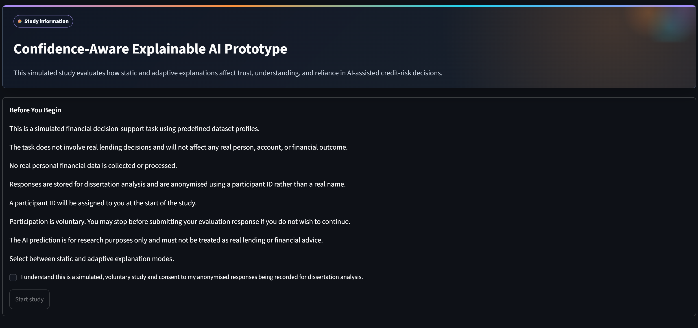

### Introduction (Select Static or Adaptive)

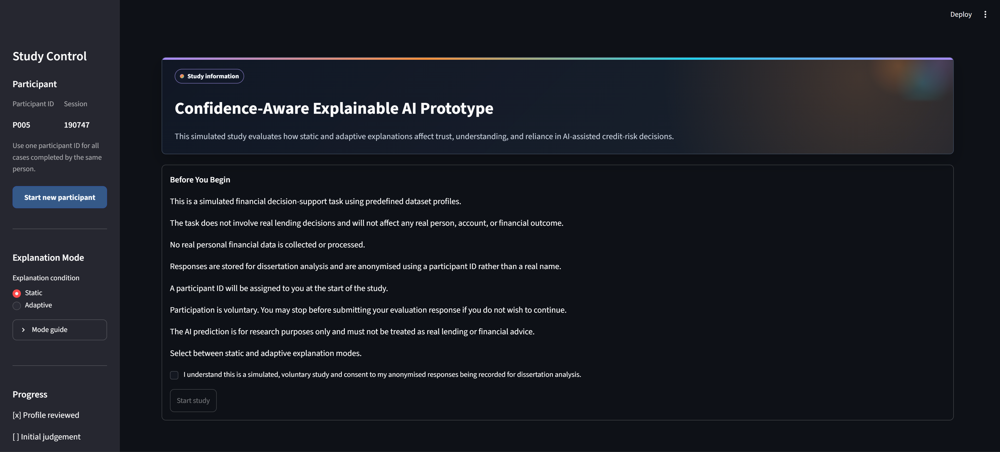

### Applicant Review

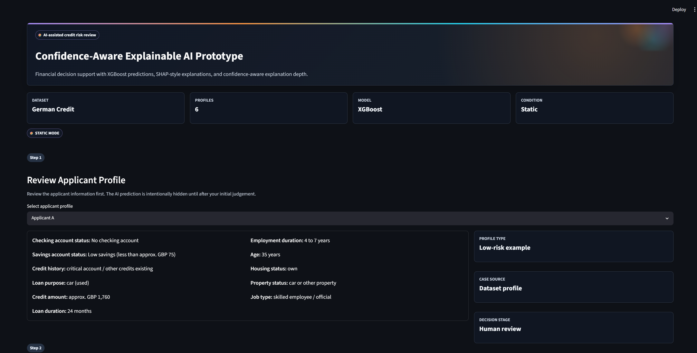

### Initial Judgement and AI Prediction

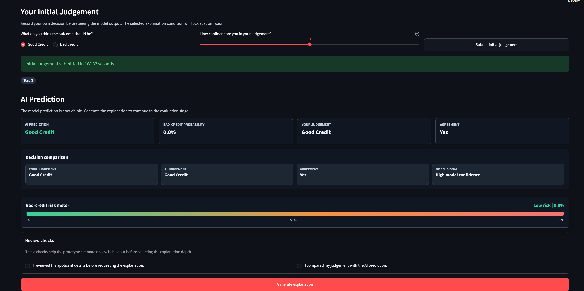

### Explanation Interface

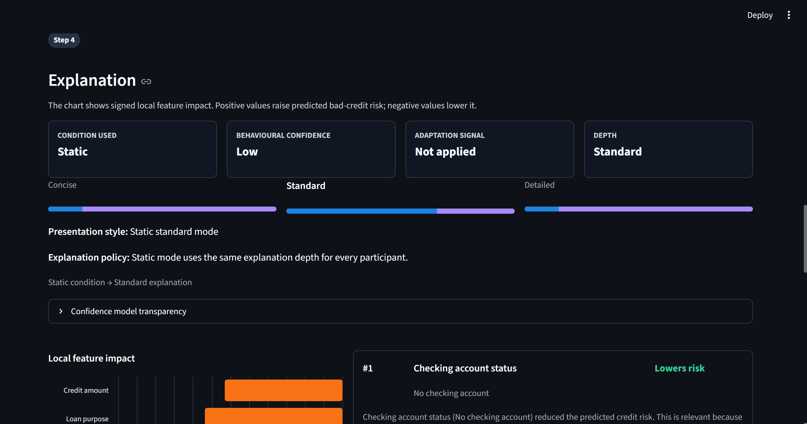

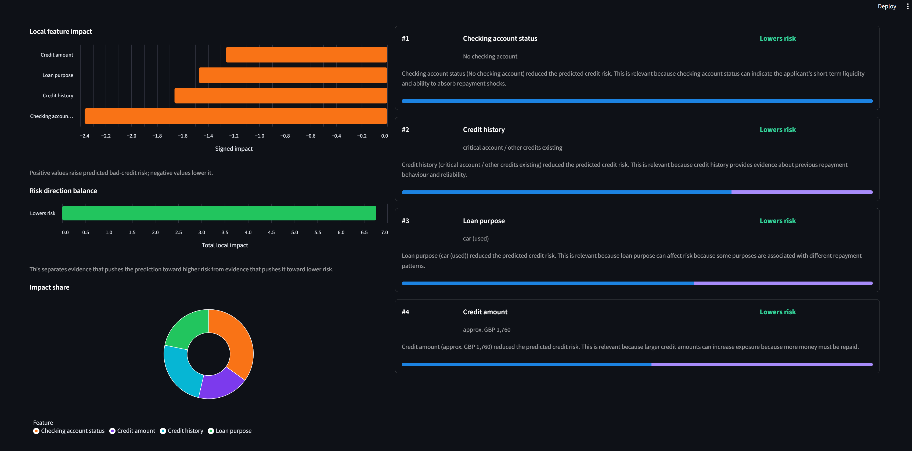

### Adaptive Explanation Depth Examples

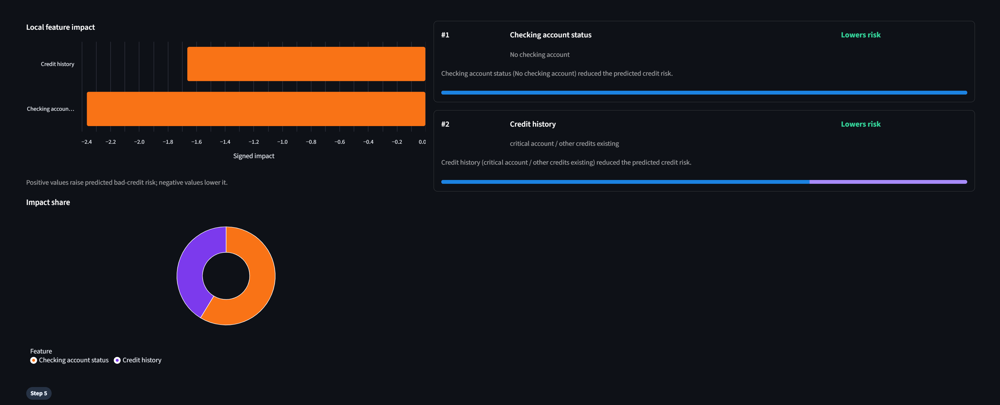

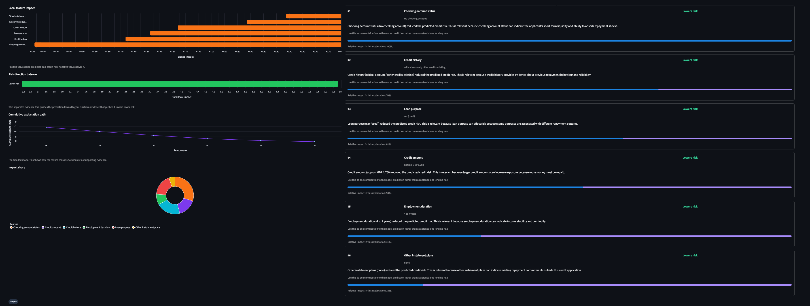

### Confidence Model Transparency

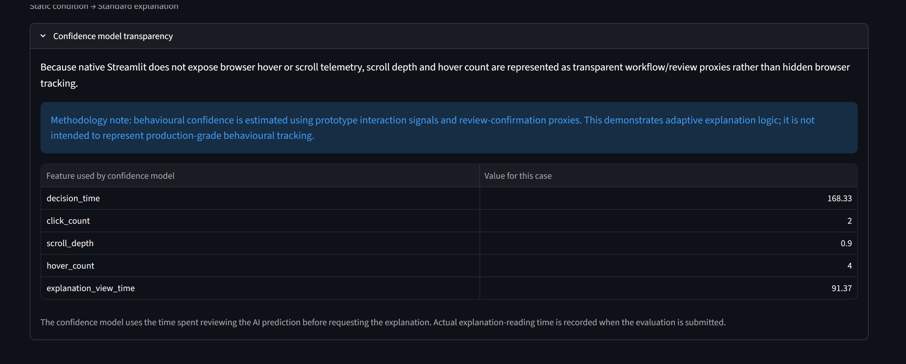

### Evaluation and Study Controls

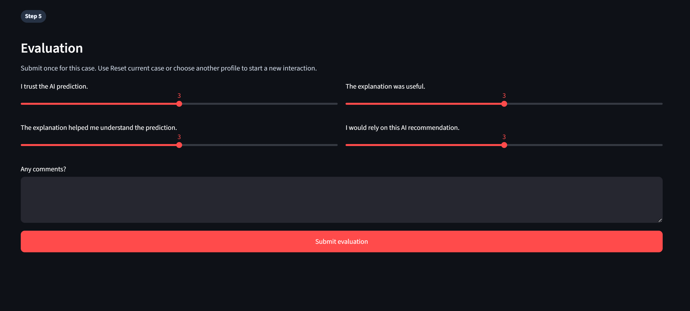

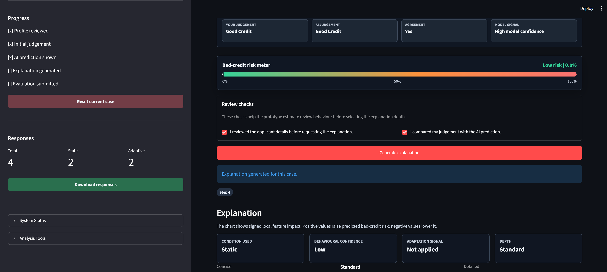

## Smoke Test

```bash
python scripts/smoke_test.py
```

The smoke test verifies that the main app files, model artefacts, dataset files, notebooks, methodology notes, and response schema are present.

## Quick Analysis

After collecting responses, run:

```bash
python scripts/analysis_summary.py
```

This prints response counts and mean trust, understanding, usefulness, and reliance scores by condition.

For a visual dashboard, run:

```bash
streamlit run scripts/analysis_dashboard.py
```

The dashboard supports the results chapter by showing:

- response counts, participant completion, and applicant-condition coverage
- mean trust, understanding, usefulness, and reliance by condition
- Likert rating distributions and rating spread by condition
- Static-vs-Adaptive comparison statistics, including mean differences, bootstrapped confidence intervals, Cohen's d, and Mann-Whitney p-values
- interaction timing, explanation depth, adaptation signals, and confidence alignment
- reliance patterns depending on whether participants agreed with the AI prediction
- comment counts, frequent comment terms, and a comment review table
- downloadable comparison tables and filtered raw responses

The dashboard also includes an admin-only section under Raw Data for deleting invalid individual response rows. A full CSV backup is saved before any row deletion.

## Reset Responses

Do not reset responses from the participant-facing app. To clear the CSV deliberately, run:

```bash
python scripts/reset_responses.py
```

The script backs up the current CSV into `data/response_backups/` first, then recreates `data/responses/user_study_responses.csv` with clean headers.
